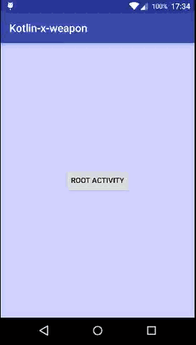
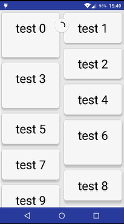

# Kotlin X Weapon
 Kotlin x weapon is a library of extension functions for android. What is [Kotlin](https://github.com/JetBrains/kotlin)?

[Download Demo] (https://github.com/bluzwong/kotlin-x-weapon/releases/download/v0.9.1/example.apk)
##Example
###Swipe back finish activity
 
###### Kotlin:
```kotlin
                                                    // ↓↓↓↓↓↓ 1.implements this interface
public class MainActivityKt : AppCompatActivity(), SwipeBackActivitySupport {

    // 2.provide activity
    override fun provideActivity(): Activity = this

    override fun onCreate(savedInstanceState: Bundle?) {
        super<AppCompatActivity>.onCreate(savedInstanceState)
        setContentView(R.layout.activity_main)
        // 3.helper init
        initSwipeBack()
        // your other code...
    }

    override fun finish() {
        super<AppCompatActivity>.finish()
        // 4.show animation when back
        onSwipeFinish()
        // 5.set activity theme see AndroidManifest -> android:theme="@style/BluzWong.SwipeBack.Transparent.Theme"
    }
}
```

###### Java:
```java

public class MainActivity extends AppCompatActivity {
    // 1.get helper
    SwipeBackActivityHelper helper = new SwipeBackActivityHelper(this);

    @Override
    protected void onCreate(Bundle savedInstanceState) {
        super.onCreate(savedInstanceState);
        setContentView(R.layout.activity_main);

        // 2.helper init
        helper.initSwipeBack();
        // your other code
    }

    @Override
    public void finish() {
        super.finish();
        // 3.show animation when back
        helper.onSwipeFinish();
        // 4.set activity theme see AndroidManifest -> android:theme="@style/BluzWong.SwipeBack.Transparent.Theme"
    }
}
```

####For best appearance, use transparent theme
###### AndroidManifest.xml:
```xml
<activity android:name=".MainActivityKt"
          android:theme="@style/BluzWong.SwipeBack.Transparent.Theme" />
```
####Works with ViewPager or others

###### Kotlin:
```kotlin
// your code ... in onCreate()
val vp = findViewById(R.id.vp) as ViewPager
vp.addOnPageChangeListener(object : ViewPager.OnPageChangeListener {
    override fun onPageScrollStateChanged(state: Int) {
        //throw UnsupportedOperationException()
        // your code
    }

    override fun onPageScrolled(position: Int, positionOffset: Float, positionOffsetPixels: Int) {
        //throw UnsupportedOperationException()
        // your code
    }
    // 6. when some views conflict with swipe back , you should do these, for example:
    override fun onPageSelected(position: Int) {
        if (position != 0) {
            // if the current view page is not the first, make 'vp' receive touch event. 
            disableSwipeBack()
        } else {
            // the current page return to the first one, make 'swipe back' receive touch event.
            enableSwipeBack()
        }
        // your code
    }
})
```

###### Java:
```java
// your code ... in onCreate()
vp = (ViewPager) findViewById(R.id.vp);
vp.addOnPageChangeListener(new ViewPager.OnPageChangeListener() {
    @Override
    public void onPageScrolled(int position, float positionOffset, int positionOffsetPixels) {}

    @Override
    public void onPageSelected(int position) {
        if (position != 0) {
            // if the current view page is not the first, make 'vp' receive touch event. 
            helper.disableSwipeBack();
        } else {
            // the current page return to the first one, make 'swipe back' receive touch event. 
            helper.enableSwipeBack();
        }
    }
    
    @Override
    public void onPageScrollStateChanged(int state) {}
```
###Extensions for RecyclerView
 

###### Xml:
use com.github.bluzwong.kotlin_x_weapon.XRecyclerView instead of RecyclerView
then add android:layoutAnimation="@anim/grid_layout_animation_random_bottom"
```xml
<com.github.bluzwong.kotlin_x_weapon.XRecyclerView
                android:layout_width="match_parent"
                android:layout_height="match_parent"
                android:layoutAnimation="@anim/grid_layout_animation_random_bottom"
                />
```

start animation when refresh instead of notifyDataSetChanged()
(startScheduleLayoutAnimation() is a extension function for RecyclerView ,kotlin only.No java use for now)
###### Kotlin:
```kotlin
xRecyclerView.startScheduleLayoutAnimation()
```

## Dependence

###### Gradle:
```groovy
dependencies {
    compile 'com.github.bluzwong:kotlin-x-weapon:0.9.4@aar'
}
```
######to be continued...